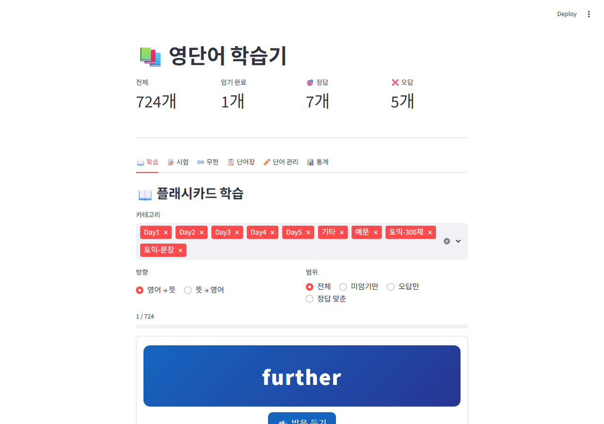
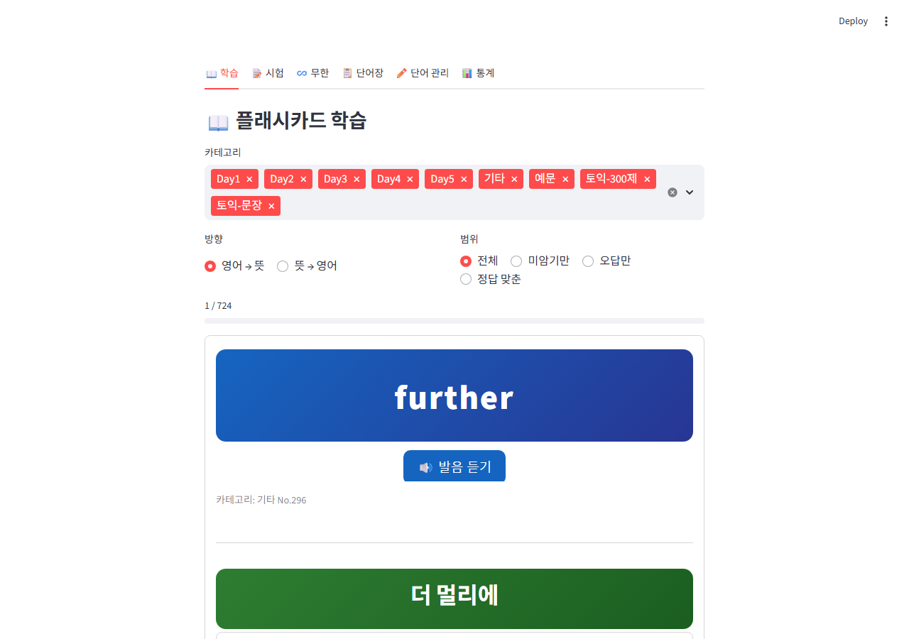
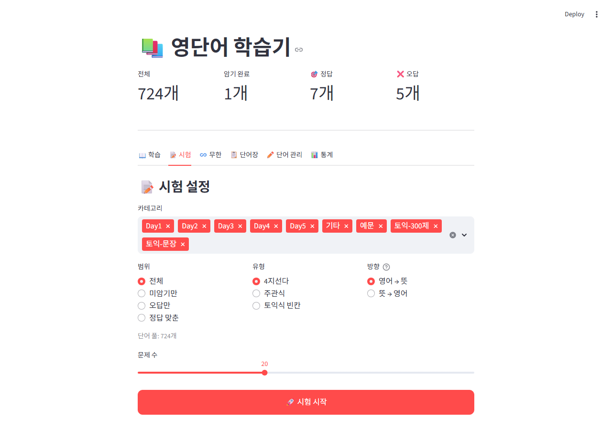
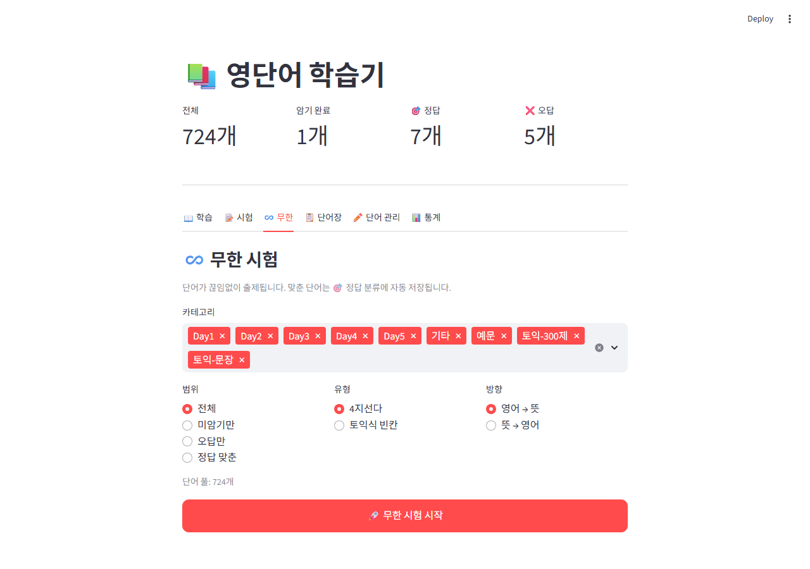
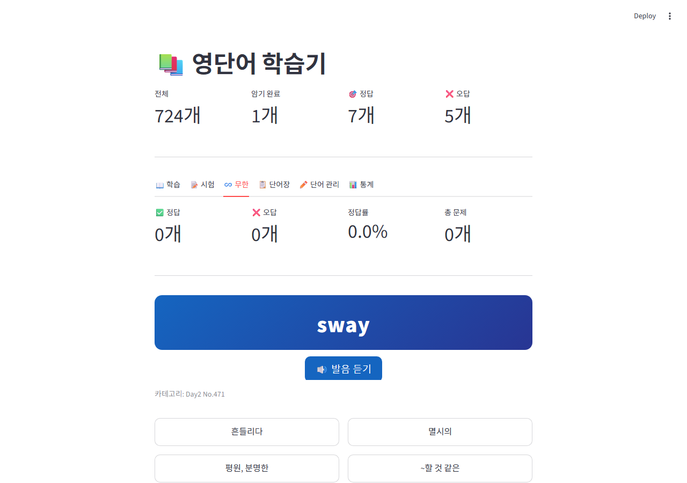
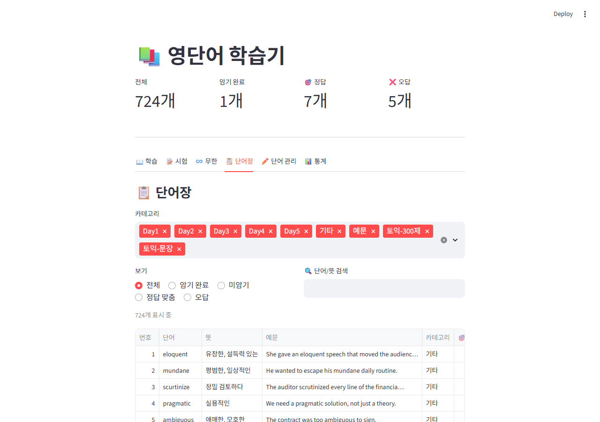
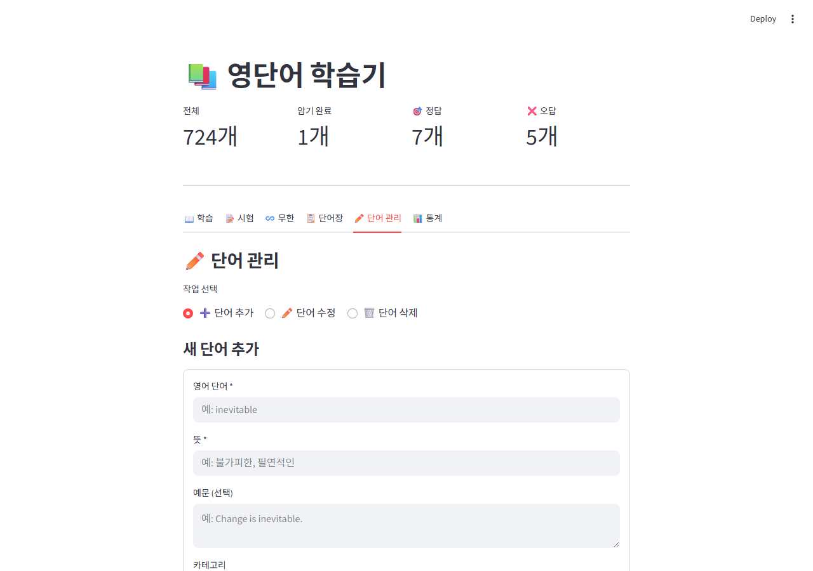
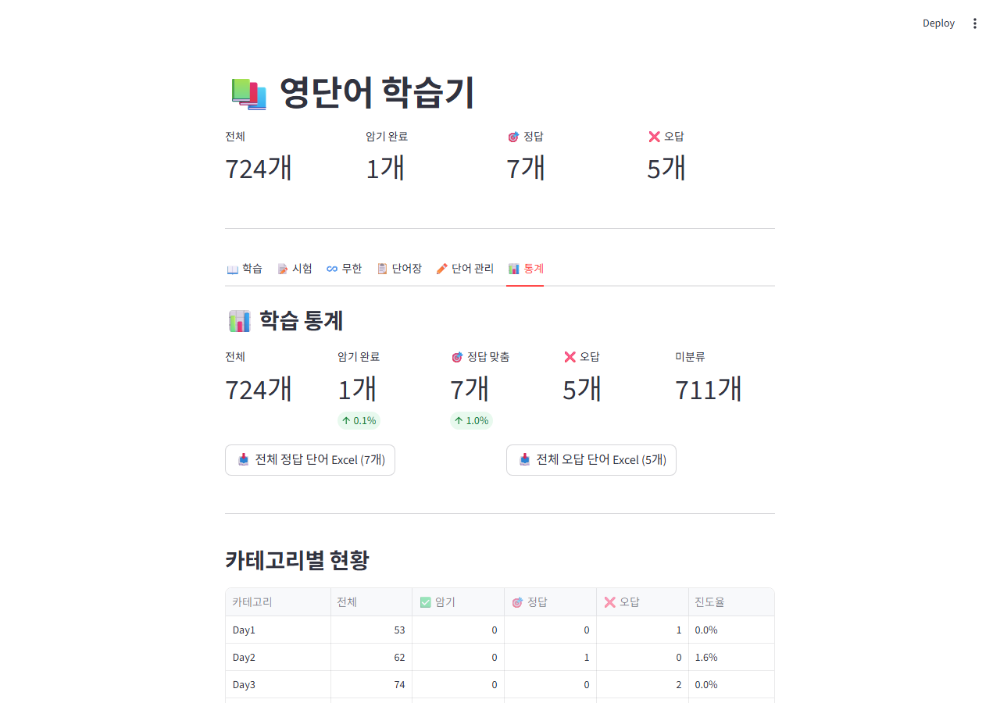

# 📚 영단어 학습기

> Excel 기반 영단어 학습 웹 앱 — 플래시카드, 시험, 무한 퀴즈, 단어 관리, 학습 통계를 하나의 앱에서

**Python · Streamlit · openpyxl · pandas**

[](https://python.org)
[](https://streamlit.io)
[](LICENSE)
[](https://honeyenglish.streamlit.app/)

> **바로 사용하기 →** [https://honeyenglish.streamlit.app](https://honeyenglish.streamlit.app/)  
> PC · 스마트폰 모두 접속 가능합니다.

---

## 목차

- [소개](#소개)
- [주요 기능](#주요-기능)
- [스크린샷](#스크린샷)
- [기술 스택](#기술-스택)
- [설치 및 실행](#설치-및-실행)
- [프로젝트 구조](#프로젝트-구조)
- [Android 앱](#android-앱)

---

## 소개

Excel 파일(`Word.xlsx`)에 저장된 영단어를 기반으로 동작하는 **모바일 최적화 학습 웹 앱**입니다.  
플래시카드 학습부터 토익식 빈칸 시험, 실시간 정답률 추적까지 단어 암기에 필요한 모든 기능을 제공합니다.

**[https://honeyenglish.streamlit.app](https://honeyenglish.streamlit.app/)** 에서 설치 없이 바로 사용할 수 있으며,  
PC는 물론 **스마트폰 브라우저**에서도 그대로 접속해 학습할 수 있습니다.

학습 진도는 **브라우저 localStorage**에 자동 저장되어 어디서든 이어서 공부할 수 있습니다.

---

## 주요 기능

| 탭 | 기능 요약 |
|---|---|
| 📖 학습 | 플래시카드 (앞면→뒷면), TTS 발음, 카테고리·범위 필터, 암기 완료 표시 |
| 📝 시험 | 4지선다 / 주관식 / 토익식 빈칸, 오답 노트, Excel 다운로드 |
| ♾️ 무한 시험 | 끊임없이 출제, 실시간 정답률, 세션 오답 관리 |
| 📋 단어장 | 전체 단어 조회, 검색, 상태 필터(암기·오답·정답) |
| ✏️ 단어 관리 | 단어 추가·수정·삭제 (Excel 파일 직접 반영) |
| 📊 통계 | 카테고리별 진도율, 시험 기록, 정답·오답 Excel 일괄 다운로드 |

---

## 스크린샷

### 📖 플래시카드 학습

카드 앞면에 영어 단어를 보여주고 버튼을 누르면 뜻이 공개됩니다.  
TTS 발음 듣기, 카테고리·범위 필터, 암기 완료 체크를 지원합니다.

| 앞면 (문제) | 뒷면 (정답 공개) |
|---|---|
|  |  |

---

### 📝 시험

4지선다·주관식·토익식 빈칸 세 가지 유형을 지원합니다.  
시험 후 오답 노트와 정답 단어를 Excel로 내려받을 수 있습니다.

| 시험 설정 | 시험 진행 중 |
|---|---|
|  |  |

---

### ♾️ 무한 시험

단어가 끊임없이 출제됩니다. 맞춘 단어는 🎯 정답으로 자동 분류되고  
실시간 정답률·오답 단어를 세션 내내 추적합니다.

| 무한 시험 설정 | 무한 시험 진행 중 |
|---|---|
|  |  |

---

### 📋 단어장

전체 724개 단어를 카테고리·학습 상태(암기 완료 / 오답 / 정답 맞춤)로 필터링하고  
단어·뜻 키워드로 검색할 수 있습니다.



---

### ✏️ 단어 관리

단어 추가·수정·삭제를 웹 UI에서 바로 수행하면 Excel 파일에 즉시 반영됩니다.  
새 카테고리를 직접 입력해 분류 체계를 자유롭게 확장할 수 있습니다.



---

### 📊 학습 통계

카테고리별 진도율 테이블, 시험 기록(최근 20회), 평균·최고 점수를 한눈에 확인합니다.  
진도 초기화 및 정답·오답 단어 Excel 일괄 다운로드를 지원합니다.



---

## 기술 스택

| 분류 | 기술 |
|---|---|
| 언어 | Python 3.10+ |
| 웹 프레임워크 | [Streamlit](https://streamlit.io) |
| 데이터 처리 | pandas, openpyxl |
| 진도 저장 | JSON 파일 + 브라우저 localStorage (streamlit-js-eval) |
| TTS | Web Speech API (브라우저 내장) |
| 모바일 앱 | Kivy + buildozer (Android WebView 래퍼) |

---

## 설치 및 실행

### 요구사항

- Python 3.10 이상
- `Word.xlsx` 파일 (영단어 데이터)

### 1. 의존성 설치

```bash
pip install -r requirements.txt
```

`requirements.txt`:
```
streamlit
openpyxl
pandas
streamlit-js-eval
```

### 2. 앱 실행

```bash
streamlit run app.py
```

브라우저에서 `http://localhost:8501` 접속

### 3. 스마트폰에서 접속 (같은 Wi-Fi)

```bash
# Windows
start_server.bat

# PowerShell
.\start_server.ps1
```

출력된 네트워크 주소(`http://<PC_IP>:8501`)를 스마트폰 브라우저에서 열면 됩니다.

---

## 프로젝트 구조

```
English_word/
├── app.py              # Streamlit 메인 앱
├── Word.xlsx           # 영단어 데이터 (번호·단어·뜻·예문·카테고리)
├── progress.json       # 학습 진도 저장 파일
├── requirements.txt
├── start_server.bat    # Windows 서버 실행 스크립트
├── start_server.ps1    # PowerShell 서버 실행 스크립트
├── android_app/
│   ├── main.py         # Kivy Android WebView 래퍼
│   └── buildozer.spec  # APK 빌드 설정
└── docs/
    └── screenshots/    # README용 스크린샷
```

### Word.xlsx 컬럼 구조

| 열 | 내용 |
|---|---|
| A | 번호 |
| B | 영어 단어 |
| C | 뜻 (한국어) |
| D | 예문 |
| I | 카테고리 |

---

## Android 앱

`android_app/` 폴더에 Kivy 기반 Android WebView 래퍼가 포함되어 있습니다.  
PC에서 Streamlit 서버를 실행한 뒤, APK를 설치한 스마트폰에서 서버 IP를 입력하면  
네이티브 앱처럼 영단어 학습기를 사용할 수 있습니다.

```bash
# APK 빌드 (buildozer 필요)
cd android_app
buildozer android debug
```

---

## 데이터 흐름

```
Word.xlsx
    │  openpyxl로 읽기 (캐시: mtime 기반)
    ▼
Streamlit 세션
    │  학습 진도 (암기·정답·오답)
    ├─▶ progress.json     (로컬 파일)
    └─▶ localStorage      (브라우저, 클라우드 환경 지속성)
```

---

*Made with Streamlit · Python*
